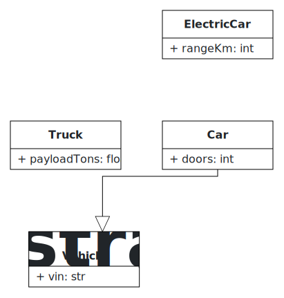

# UML Drawing — diagrams as code, for your docs

[](LICENSE)
[](https://agentskills.io)

**An [Agent Skill](https://agentskills.io) that gives your AI coding agent one
job and makes it do it right: put a correct UML class diagram — as a real
embeddable image — into your docs.**

<p align="center">
  
</p>
<p align="center"><sub>Rendered from <a href="examples/vehicles.py"><code>examples/vehicles.py</code></a> in one call — no browser, no plugin. This SVG is the skill's actual output.</sub></p>

Ask your agent to "add a class diagram to the README" today and you get one of
two bad outcomes: a diagram with the modeling subtly wrong (reversed arrows,
invalid multiplicities, inheritance backwards), or a code block that never
renders as a picture. This skill fixes both.

```text
You:   "Add a class diagram of our blog data model to the README."
Agent: ‣ models Users · Posts · Comments with correct multiplicities
       ‣ renders it to a real SVG itself — one call, no browser
       ‣ embeds  
```

A correct diagram in your docs — as embeddable code or a real image that
renders on GitHub, GitLab, wikis, and slides, no plugin.

## Why it's different

Most "diagram" tools give you a picture *or* a model. This gives you both, and
keeps them in sync:

- **Correct by construction.** The diagram is always built as a
  structurally-validated [BESSER](https://github.com/BESSER-PEARL/BESSER)
  B-UML model — not freehand ASCII the model guessed at. Multiplicities,
  associations, and inheritance are right.
- **Start from a description *or* your code.** Describe the domain, or point
  the agent at existing source and let it model the structure.
- **Two ways to embed — and the agent renders the image itself.** Drop the
  **B-UML code** straight into your `.md`, or get a real **SVG/PNG**: the agent
  renders it with a single call to BESSER's headless `B-UML → SVG` endpoint —
  no browser, no Mermaid plugin, no rendering service. (Want to hand-place the
  layout? Export from [editor.besser-pearl.org](https://editor.besser-pearl.org)
  instead — same model.)
- **It doesn't drift.** Both come from one model you keep in the repo. Change
  the model, re-deliver, commit — the doc never goes stale.
- **The diagram can become the system.** The same model generates working code
  — Python, SQL, FastAPI, Django, React, and more. Your documentation diagram
  *is* your source of truth.

## Install

```bash
# Any skills-compatible agent (Claude Code, Cursor, Cline, Windsurf, Copilot, …)
npx skills add BESSER-PEARL/uml-drawing --all
```

Or copy the `uml-drawing/` folder into your agent's skills directory
(`.claude/skills/`, `.agents/skills/`, …).

## How it works

1. **Model it** — the agent builds a B-UML class model from your description
   or from existing code it reads (always class diagrams, always via B-UML).
2. **Deliver it** — embed the **B-UML code** in your `.md`, or get a rendered
   **SVG/PNG**: one HTTP call to BESSER's headless endpoint (no browser), or a
   hand-tuned export from the BESSER editor when layout matters.
3. **Keep it current** — the model is the source of truth; change it and
   re-deliver. The doc never drifts.

Full instructions live in [`SKILL.md`](uml-drawing/SKILL.md); your agent
loads them automatically when a task matches.

## Render an image in one call

Once the agent has written the model (say `data-model.py`), turning it into an
embeddable SVG is a single request — no browser, no plugin, no rendering
service to host:

```bash
curl -X POST https://editor.besser-pearl.org/besser_api/get-svg \
  -F "buml_file=@data-model.py;type=text/x-python" \
  -o docs/img/data-model.svg
```

Then drop `` into your doc. Done.

## Examples

Ready-to-render B-UML models live in [`examples/`](examples/), one per
class-diagram feature the skill handles:

| Example | Shows |
|---------|-------|
| [`ecommerce.py`](examples/ecommerce.py) | associations · multiplicities · composition |
| [`vehicles.py`](examples/vehicles.py)   | inheritance hierarchy · abstract classes |
| [`tasks.py`](examples/tasks.py)         | enumerations · composition |
| [`org.py`](examples/org.py)             | self-referential associations |
| [`enroll.py`](examples/enroll.py)       | association classes |

Render any of them with the one-call command above.

## Part of the BESSER skill family

This skill is the "diagrams for docs" front door to BESSER. For the full
platform — deep modeling, every generator, troubleshooting, contributing —
see **[besser-skills](https://github.com/BESSER-PEARL/besser-skills)**.

## License

Apache-2.0.
