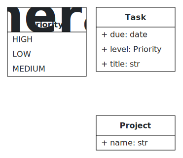

# Examples

Five ready-to-render B-UML class models, one per feature the `uml-drawing`
skill handles. Each file is a complete, `validate()`-checked
[BESSER](https://github.com/BESSER-PEARL/BESSER) `DomainModel`.

| File | Demonstrates |
|------|--------------|
| [`ecommerce.py`](ecommerce.py) | associations · 1..1 / 0..\* / 1..\* multiplicities · composition |
| [`vehicles.py`](vehicles.py)   | multi-level inheritance · abstract superclass |
| [`tasks.py`](tasks.py)         | enumeration as an attribute type · composition |
| [`org.py`](org.py)             | self-referential association (manages / managedBy) |
| [`enroll.py`](enroll.py)       | association class (attribute on the link) |

## Rendered output

`vehicles.py` and `tasks.py` ship with the SVG the endpoint returns — each
produced by the one-call command below, straight from the matching `.py`:

| [`vehicles.py`](vehicles.py) → [`vehicles.svg`](vehicles.svg) | [`tasks.py`](tasks.py) → [`tasks.svg`](tasks.svg) |
|:---:|:---:|
|  |  |

## Render one to an image

No browser, no install — one HTTP call to BESSER's headless `B-UML → SVG`
endpoint:

```bash
curl -X POST https://editor.besser-pearl.org/besser_api/get-svg \
  -F "buml_file=@vehicles.py;type=text/x-python" \
  -o vehicles.svg
```

Then embed it: ``.

## Or generate code from the same model

These are real B-UML models, so the very same file can drive any BESSER
generator (Python, SQL, FastAPI, Django, React, …) — see the
[besser-generators](https://github.com/BESSER-PEARL/besser-skills) skill.
